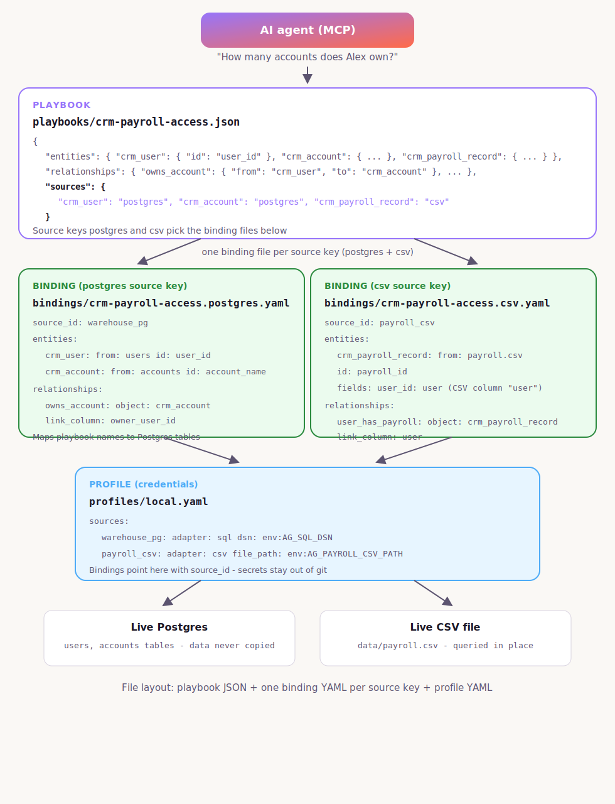
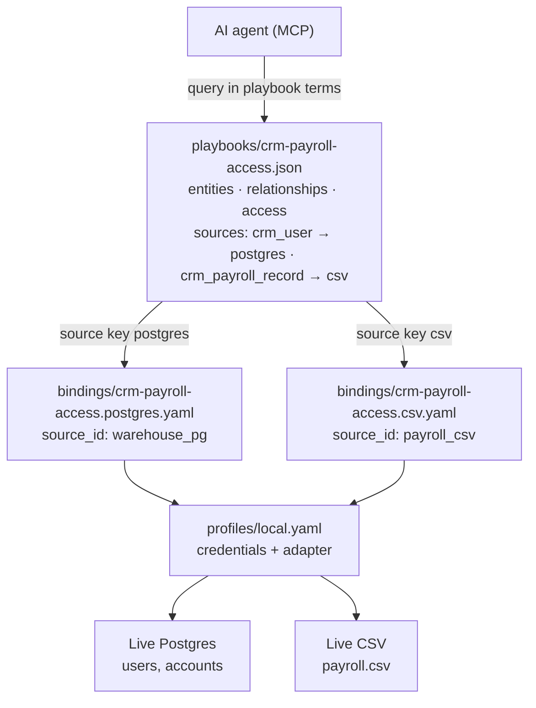

# Playbook, binding, and profile structure

Anything CLI separates **what the business means** (playbook) from **where data lives** (bindings + profile). Data is queried in place — it is not copied into the agent prompt.

## Diagram



## File layout example

Demo playbook **`crm-payroll-access`**, two source keys **`postgres`** and **`csv`**:

| File | Role |
|------|------|
| `playbooks/crm-payroll-access.json` | Entities, relationships, routing (`sources`), access rules |
| `bindings/crm-payroll-access.postgres.yaml` | Maps CRM entities to Postgres tables |
| `bindings/crm-payroll-access.csv.yaml` | Maps payroll entity to CSV columns |
| `profiles/local.yaml` | Credentials referenced by each binding's `source_id` |

Binding filenames are inferred as `{playbook_id}.{source_key}.yaml` unless you override the `bindings` map in the playbook.

**One binding file per distinct source key** — not one file per entity. `crm_user` and `crm_account` both use `postgres`, so they belong in the same `crm-payroll-access.postgres.yaml`.

## Mermaid (for GitHub / docs tools)



## Routing in `crm-payroll-access.json`

```json
{
  "id": "crm-payroll-access",
  "sources": {
    "crm_user": "postgres",
    "crm_account": "postgres",
    "crm_payroll_record": "csv"
  }
}
```

Runtime resolves:

- `crm_user` or `crm_account` → binding stem `crm-payroll-access.postgres`
- `crm_payroll_record` → binding stem `crm-payroll-access.csv`

## Binding → profile

Each binding points at a profile source (not the routing key):

```yaml
# bindings/crm-payroll-access.postgres.yaml
source_id: warehouse_pg
entities:
  crm_user:
    from: users
    id: user_id
    fields: [full_name]
```

```yaml
# profiles/local.yaml
sources:
  warehouse_pg:
    adapter: sql
    dsn: env:AG_SQL_DSN
  payroll_csv:
    adapter: csv
    file_path: env:AG_PAYROLL_CSV_PATH
```
