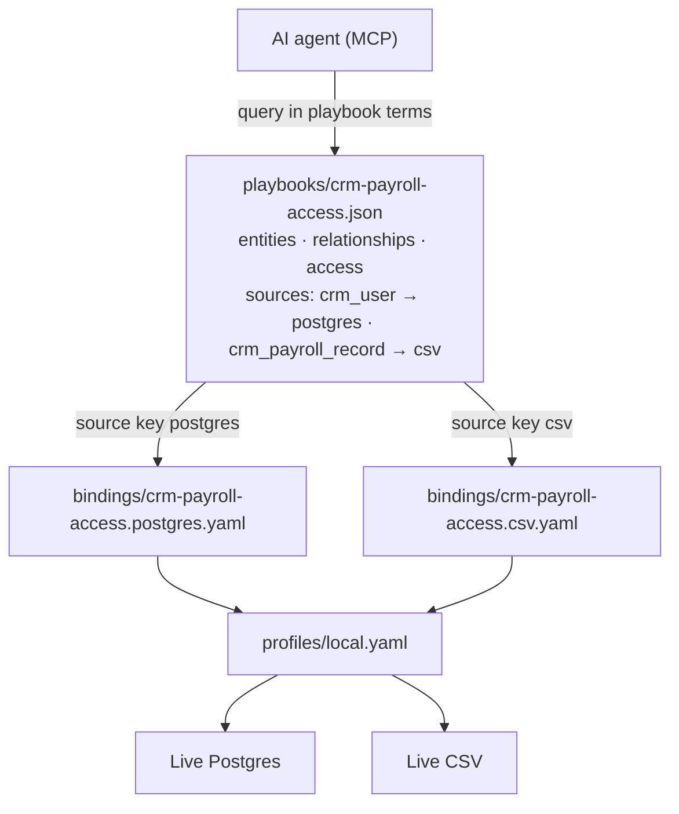

# Playbooks

Sample playbooks for AnythingGraph CLI. Setup and MCP usage: **[main README](../README.md)**.

**Step-by-step authoring guide (web):** [Playbooks documentation](https://anythinggraph.github.io/playbooks/) — or follow the sections below.

**These are demo playbooks only** — names like `crm_user`, `owns_account`, and `crm-payroll-access` illustrate the format. Author your own playbooks for your domain.

---

## What it does

### The problem

Your data already lives across Postgres, Salesforce, CSV files, and more. Your AI agent does not.

Without a playbook, every agent session starts from scratch:

- You paste schema dumps into the prompt
- The agent guesses what "customer" or "account" means
- It writes ad-hoc SQL that breaks when a column is renamed
- It cannot follow relationships across systems (CRM in Postgres, payroll in CSV)
- It has no idea who is allowed to see which rows

**Result:** hallucinated answers, huge token bills, inconsistent results across teams, and no audit trail.

### Before vs after

**Before (no playbook)**

```
User: "How many accounts does Alex Anderson own?"

Agent:
  1. Dump 50 tables into context        → 8,000 tokens
  2. Guess: users? accounts? owners?    → wrong join
  3. Return: "Alex owns 12 accounts"    → no proof, possibly wrong
```

**After (with playbook `crm-payroll-access`)**

```
User: "How many accounts does Alex Anderson own?"

Agent:
  1. Load playbook vocabulary           → crm_user, crm_account, owns_account
  2. Resolve Alex → user_id via binding → 1 governed query
  3. Count owns_account relationships   → 3 accounts
  4. Return structured proof            → playbook, plan, source rows
```

Same question. Fraction of the tokens. Answer tied to real data.

### What a playbook gives you

| Without a playbook | With a playbook |
|--------------------|-----------------|
| Schema stuffed into every prompt | Stable business vocabulary (`crm_user`, `owns_account`) |
| Agent invents SQL from chat | Governed path: playbook → plan → live source |
| One database at a time | Federated: Postgres + CSV + Salesforce in one graph |
| "Trust me" answers | Auditable proof — which rows, which relationship |
| Access control in prompt instructions | ReBAC rules in the playbook itself |

### ROI in plain terms

| Metric | Typical impact |
|--------|----------------|
| **Tokens per query** | 90% less context — agents query structured facts, not full schemas |
| **Hallucination risk** | Lower — answers grounded in live rows and declared relationships |
| **Cross-system questions** | Possible — e.g. "show payroll for users who own enterprise accounts" across Postgres + CSV |
| **Maintenance** | IT renames `owner_user_id` → update one binding YAML, not every prompt |
| **Team consistency** | Everyone uses the same playbook — same definitions, same access rules |

**One sentence:** A playbook is your organization's **business dictionary + relationship map + access rules** — shipped as a JSON file, queried against live data without copying it.

---

| Playbook | Sources |
|----------|---------|
| `crm-example` | Postgres |
| `simple-crm-access` | Postgres |
| `crm-payroll-access` | Postgres + CSV |
| `salesforce-lead-access` | Salesforce (User + Lead) |

---

## How to write a playbook and bindings

A **playbook** (`playbooks/<id>.json`) is your business vocabulary, routing, and access rules. **Bindings** (`../bindings/<playbook_id>.<source>.yaml`) map that vocabulary to real tables or files. Credentials live in `../profiles/local.yaml`.

Working example: `crm-payroll-access.json` with `../bindings/crm-payroll-access.postgres.yaml` and `../bindings/crm-payroll-access.csv.yaml`.

**Structure diagram:** [playbook-structure.svg](../docs/playbook-structure.svg) · [playbook-structure.md](../docs/playbook-structure.md) (includes Mermaid for GitHub).

### How the pieces connect



For playbook **`crm-payroll-access`** with source keys **`postgres`** and **`csv`**, you typically author:

1. `playbooks/crm-payroll-access.json`
2. `bindings/crm-payroll-access.postgres.yaml` — all entities routed to `postgres` (`crm_user`, `crm_account`)
3. `bindings/crm-payroll-access.csv.yaml` — all entities routed to `csv` (`crm_payroll_record`)
4. `profiles/local.yaml` — credentials each binding references via `source_id`

### 1. Playbook JSON — compact format

| Block | Purpose |
|-------|---------|
| `id`, `name`, `description` | Playbook identity (`name` defaults from `id` if omitted) |
| `entities` | Map of entity name → `{ "identifier": "<id field>", "attributes": [...] }` |
| `relationships` | Map of relationship name → `{ "from", "to" }` entity names |
| `sources` | Map of entity name → source key (`postgres`, `csv`, `salesforce`, …) |
| `access` | Optional ReBAC — subject + allow rules (expanded to full rules at load time) |

Binding file stems are inferred automatically: source key `postgres` on playbook `crm-payroll-access` → `crm-payroll-access.postgres.yaml`.

```json
{
  "id": "crm-payroll-access",
  "name": "CRM + payroll access",
  "description": "Users and accounts in Postgres; payroll in CSV.",
  "entities": {
    "crm_user": { "identifier": "user_id", "attributes": ["full_name"] },
    "crm_account": { "identifier": "account_name", "attributes": ["industry"] },
    "crm_payroll_record": {
      "identifier": "payroll_id",
      "attributes": ["user_id", "pay_period", "gross_pay", "currency", "pay_date"]
    }
  },
  "relationships": {
    "owns_account": { "from": "crm_user", "to": "crm_account" },
    "user_has_payroll": { "from": "crm_user", "to": "crm_payroll_record" }
  },
  "sources": {
    "crm_user": "postgres",
    "crm_account": "postgres",
    "crm_payroll_record": "csv"
  },
  "access": {
    "summary": "CRM users read accounts they own and their own payroll records.",
    "subject": "crm_user",
    "subject_id": "user_id",
    "allow": [
      { "relationship": "owns_account", "resource": "crm_account" },
      { "relationship": "user_has_payroll", "resource": "crm_payroll_record" }
    ]
  }
}
```

**Legacy array format still loads:** `entities[]`, `entity_relationships[]`, `entity_sources` + `bindings`, and full `relationship_access_rules` blocks. New compact playbooks must use `identifier` + `attributes` on entities (not `id` / `fields`).

**Field names** in the playbook (`identifier`, `attributes`) are the stable vocabulary agents use. Physical column names are mapped in binding YAML (`id`, `fields`) — only where they differ from playbook names.

### 2. Binding YAML — minimal shape

Each binding file needs:

- **`source_id`** — profile source in `profiles/local.yaml`
- **`entities`** — table/file, identifier (`id` or `id_field`), and fields
- **`relationships`** — `object` entity + `link_column` on the object side

Adapter type is inferred from the profile source or file stem (`.postgres` → `sql`, `.csv` → `csv`, `.salesforce` → `soql`). Lookups and count/list queries are compiled automatically.

**Postgres** (`../bindings/crm-payroll-access.postgres.yaml`):

```yaml
source_id: warehouse_pg

entities:
  crm_user:
    from: users
    id: user_id
    fields: [full_name]

  crm_account:
    from: accounts
    id: account_name
    fields: [industry]

relationships:
  owns_account:
    object: crm_account
    link_column: owner_user_id
```

**CSV** (`../bindings/crm-payroll-access.csv.yaml`):

```yaml
source_id: payroll_csv

entities:
  crm_user:
    from: payroll.csv
    id: user_id
    fields:
      user_id: user
      full_name: full_name

  crm_payroll_record:
    from: payroll.csv
    id: payroll_id
    fields:
      user_id: user

relationships:
  user_has_payroll:
    object: crm_payroll_record
    link_column: user
```

When the CSV column differs from the playbook field (`user` vs `user_id`), map it in `fields` — left is playbook field, right is physical column. Same-name fields can be omitted; the runtime fills them from the playbook.

**Salesforce** (`../bindings/salesforce-lead-access.salesforce.yaml`):

```yaml
source_id: salesforce_main

entities:
  crm_user:
    from: User
    id: Id
    fields:
      user_id: Id
      full_name: Name

  crm_lead:
    from: Lead
    id: Id
    fields:
      lead_id: Id
      lead_name: Name

relationships:
  assigned_to:
    object: crm_lead
    link_column: OwnerId
```

Legacy binding fields (`adapter`, `playbook_id`, `version`, `join.on`, manual `operations`) still work.

### 3. Profile — credentials

`../profiles/local.yaml` registers sources referenced by `source_id`:

```yaml
sources:
  warehouse_pg:
    adapter: sql
    dsn: env:AG_SQL_DSN
  payroll_csv:
    adapter: csv
    file_path: env:AG_PAYROLL_CSV_PATH
  salesforce_main:
    adapter: soql
    instance_url: env:AG_SF_INSTANCE_URL
    auth: env:AG_SF_ACCESS_TOKEN
```

Copy **`../.env.example`** to **`../.env`**, fill in values, then run **`../start-all.sh`** (loads `.env` automatically). See `.env.example` for all `AG_*` variables.

### 4. File layout

```text
playbooks/crm-payroll-access.json
bindings/crm-payroll-access.postgres.yaml
bindings/crm-payroll-access.csv.yaml
profiles/local.yaml
```

### 5. Validate and test

From the ag-cli root:

```bash
cargo run -p anythinggraph-ag -- validate --playbooks playbooks
./start-all.sh
```

Then via MCP `query_graph` (resolve user by name, count a relationship) or:

```bash
curl -s http://127.0.0.1:8787/query \
  -H 'Content-Type: application/json' \
  -d '{
    "playbook_id": "crm-payroll-access",
    "resolve": { "entity": "crm_user", "by_name": "Alex Anderson" },
    "count": { "relationship": "owns_account", "object_entity": "crm_account" }
  }'
```

Omit `binding_name` on queries — the runtime routes from `sources` + binding file stems based on the object entity.

For agent-assisted mapping, use MCP (admin token) per **[AGENTS.md](../AGENTS.md)**: `propose_playbook` → `save_playbook` → `get_binding("crm-payroll-access.postgres")` as template → `propose_binding` → `save_binding` with the **same compact YAML** (never save compiled/debug output).
